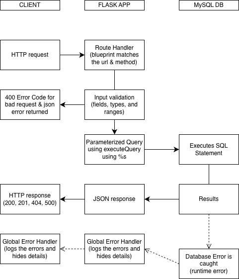

CuratedBites | Server Side Dev Class Project
-
Flask REST API for restaurant discovery & review platform. Built using Python, Flask, and MySQL

Requirements
-
- Python
- MySQL

Setup
-
1. Clone repository
2. Install dependencies
   3. Using "pip install -r requirements.txt"
4. Setup MySQL DB updating config.py if necessary based on login
5. Run application
   6. Using "flask run" in the terminal

API Routes
-
- `/api/restaurants` | restaurant CRUD
- `/api/reviews` | review CRUD (per restaurant)
- `/api/users` | user registration and favorites
- `/api/insights` | Analytics, view, and metadata endpoints

Data Flow Diagram
-

## Request Lifecycle
The client sends an HTTP request to the Curated Bites API, then at the Flask routing layer will match the URL and method/function to the correct blueprint handler. Which will either be: restaurants, reviews, or users. Then before any database interaction occurs the handler
will then validate the incoming data by checking that the required fields are present and the numerical values such as rating or price range will fall within the allowed ranges, and the reference foreign keys such as UserID, RestaurantID exist within the database. Which if it doesn't then validation fails and returns a 400 JSON error without having to touch the database.

But once the input is validated the handler will call the "executeQuery" function found within connection.py under the DB directory which then opens a mySQL connection, binds the user inputted values to the queries using '%s' placeholders, then executes the SQL statements.
Then the database returns a result set for reads or 'lastrowid' for inserts statements, which then Flask will serialize into JSON using jsonify(), which then returns the appropriate HTTP status code.
Although if a database error occurs at any point, it will be caught, logged on the server side, and then provide a generic 500 response which doesn't show database details to the end-user.

## Security

All of the SQL queries use parameterized statements using '%s' placeholder syntax which is supported using the 'mysql-connector-python' dependency. The user inputted values are then passed to 'cursor.execute()' and then are never concatenated into the query string directly
thus an attempted payload such as `'OR 1=1 --`, will then be treated as a literal string value rather than allowing executable SQL statements to be inputted, to stop the SQL injection attempt.
Although beyond using parameterization, all the endpoints validates its inputs before issuing any SQL query and that the required fields are present, and the numerical fields are then casted with 'int()' inside of try/except blocks which confirms weather the integer is valid in the domain, email addresses containing '@' character. 
The foreign keys are then confirmed with a preliminary `SELECT` before dependent inserts can proceed.
Lastly, global `'@app.errorhandler(RuntimeError)'` will catch the unhandled DB exceptions and then returns generic database error occurred messages to the client, so then that the MySQL error isn't displayed publicly.

## Indexes
There were two B-Tree indexes added to the `Schema.sql` which speeds up frequent lookup patterns in the API, which both target FK columns that are used in the WHERE clauses & JOINs
  
`idxReviewRestaurant` on `Review(RestaurantID)` helps speed up `/api/reviews/restaurant<id>` endpoint & the `RestaurantSummary` view both filter or join on `RestaurantID`. And without having it mySQL would then do a full scan of the Review table every query.
  
`idxFavoriteUser` on `Favorite(UserID)` helps speed up the `/api/users/<id>/favorites` endpoint & filters on the UserID. The current `UNIQUE(UserID, RestaurantID)` creates an index but is only efficient when both the colums are filtered together, as a result having a dedicated index for a UserID-only lookup fast as possible.

## View
A database view is named `RestaurantSummary` which its purpose is to encapsualte the per-restaurant aggregation that would be duplicated across various Flask routes.
This view joins five tables: Restaurant, RestaurantCuisine, Cuisine, Review, and Favorite; which aggregates 3 different metrics with a list of cuisines, it's review count, average rating, and favorite count.
 
By putting all that logic in a view rather than in Python, the SQLs is written only once and will be reusable for future endpoints that requires a restaurant overview, and the Flask route becomes a simple `SELECT * FROM ResturantSummary` which makes it easier to read and maintain than having to using a written JOIN in a query; makes the database more optimized since LEFT JOINS are used so that restaurants with no reviews or favorite will still appear with NULL or 0 counts. 
Which this view can be accessed by the endpoint `/api/insights/restaurants/summary` which is ordered by average rating then review count both in a descending order.

## Metadata & Analytics
The insight endpoints live in `routes/insights.py` using the blueprint `/api/insights` which uses read-only GET queries which are separated from the current CRUD blueprints.   
The metadata `/api/insights/schema/tables` & `/api/insights/schema/indexes` queries the `information_schema.tables` and `information_schema.statistics` which then each filter on the DB schema for this specific project Curated Bites. The first returns every user table in the database with the estimated row count, then the other reutnrs every index that is defined in the tables seeing if its unique. This basically allows a developer a view of the DB structure from an API that allows to see that the indexes are present
   
For analytics `/api/insights/top-restaurants` ranks the top 5 restaurants by it's average rating using GROUP BY on the RestaurantID and having a count of atleast 2 reviews which filters out the restaurants with only 1 review that may skew the data that is displayed in the rankings. It returns the average rating, total review count, city, and price range for each top restaurant. Going beyond just a SELECT statement, by aggregating data and ORDER BY which presents a leaderboard of the top rated restaurants.